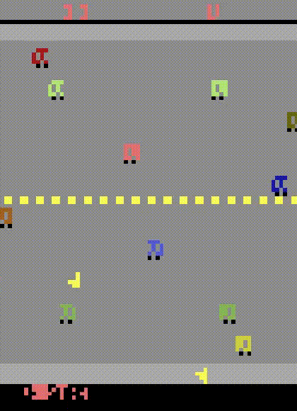

# MBARC (Atari)

Official repository of the *Model-Based Aware Reward Classifiers (MBARC)* thesis ([Atari 100k benchmark](https://paperswithcode.com/sota/atari-games-100k-on-atari-100k) version).

- [Installation](#installation)
- [How to use](#how-to-use)
- [Per-environment performance](#per-environment-performance)



*MBARC predicting 50 frames into the future from 4 initial frames on Freeway.*

## Installation

This program uses **python 3.7**, **CUDA 10.2** if enabled, and was tested on Ubuntu 20.04.1.

Run the following command to install the dependencies:
  ```shell script
  pip install torch==1.7.1 gym==0.15.7 gym[atari] opencv-python==4.4.0.42 numpy==1.16.4 tqdm
  
  git clone https://github.com/openai/baselines.git
  pip install -e baselines
  ```

### Install wandb (optional)

You can use [wandb](https://www.wandb.com/) to track your experiments:
```shell script
pip install wandb
```

To use wandb, pass the flag `--use-wandb` when running the program. See [How to use](#how-to-use) for more details about flags.

## How to use

CUDA is enabled by default, see the following section to disable it.

To run the program, run the following command from the folder containing the `mbarc` package:
```shell script
python -m mbarc
```

### Disable CUDA

To disable CUDA, pass the flag `--device cpu` to the command line. See the next section for more information about flags.

### Flags

You can pass multiple flags to the command line, a summary is printed at launch time.
The most useful flags are described in the following table:

| Flag | Value | Default | Description |
| ---- | ----- | ------- | ----------- |
| --agents | Any positive integer | 16 | The number of parallel environments to train the PPO agent on |
| --device | Any string accepted by [torch.device](https://pytorch.org/docs/stable/tensor_attributes.html#device-doc) | cuda | Sets the PyTorch's device |
| --env-name | Any game name (without the suffixes) as depicted [here](https://gym.openai.com/envs/#atari) | Freeway | Sets the gym environment | 
| --strategy | "online", "class_balanced", "square_root", "progressively_balanced" or "mbarc" | mbarc | The training strategy to use |

The following boolean flags are set to `False` if not passed to the command line:

| Flag | Description |
| ---- | ----------- |
| --render-evaluation | Renders the environments during evaluation |
| --render-training | Renders the environments during training |
| --use-modified-model | Setting this flag will replace MBARC's proposed reward prediction head with SimPLe's | 
| --use-wandb | Enables [wandb](https://www.wandb.com/) to track the experiment |

For example, to run the program without CUDA and to render the environments during training, run:
```shell script
python -m mbarc --device cpu --render-training
```

## Per-environment performance

The scores* obtained with this implementation are detailed in the following table:

| Environment | Score |
| ----------- | ---:  |
| Alien | 380 |
| Amidar | 56.8 |
| Assault | 582.3 |
| Asterix | 718.3 |
| BankHeist | 40.3 |
| ChopperCommand | 1020 |
| DemonAttack | 547.7 |
| Freeway | 23.8 |
| Frostbite | 218.7 |
| Gopher | 520 |
| Hero | 2323.5 |
| Jamesbond | 71.7 |
| Kangaroo | 380 |
| Krull | 3332.4 |
| Qbert | 356.7 |
| Seaquest | 248 |
| UpNDown | 2905 |

**Scores obtained on only one full training per environment.
 The scores are the maximum average cumulative reward obtained in the real environment.*
